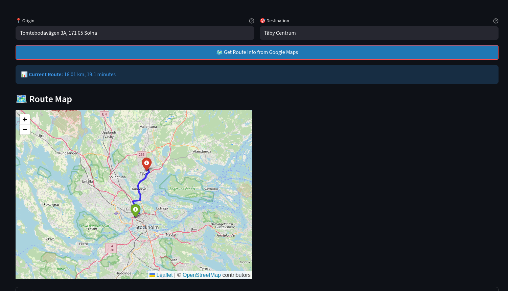
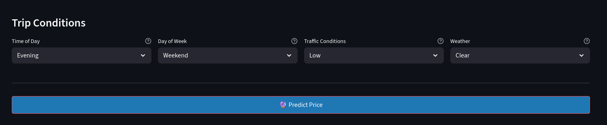
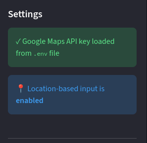
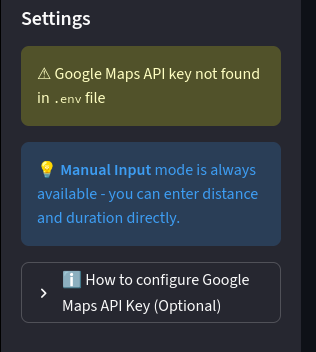

# Taxi Price Prediction - Full Stack Application

A full-stack machine learning application for predicting taxi trip prices using trip characteristics such as distance, duration, time of day, weather, and traffic conditions.

### Application Header

*Main application interface showing the taxi price prediction header and navigation options.*

## Features

- **Machine Learning Model**: Linear Regression model trained on cleaned taxi trip data
- **FastAPI Backend**: RESTful API for model predictions
- **Streamlit Frontend**: Interactive web interface with two input modes:
  -  **Location-based input** (Google Maps integration - optional)
  -  **Manual input** (always available)

### Manual Input Mode

*Manual input interface allowing users to directly enter trip distance and duration without requiring a Google Maps API key.*

### Route Visualization (Google Maps Integration)

*Interactive map showing the route between origin and destination with markers, available when using Google Maps integration.*

### Trip Conditions Selection 

*Interface for selecting trip conditions including time of day, day of week, traffic conditions, and weather.*

### API Key Configuration Status

*Sidebar showing successful Google Maps API key detection, enabling location-based input features.*

*Sidebar warning when Google Maps API key is not found, with instructions on how to configure it. Manual input mode remains available.*

## Notebooks Overview

The model development process is documented in a series of Jupyter notebooks:

1. **01_data_overview.ipynb**: Initial exploratory data analysis, data types, and missing value identification
2. **02_visual_analysis.ipynb**: Data visualization and distribution analysis
3. **03_imputation_overview.ipynb**: Evaluation of different imputation strategies (MICE for numerical, most-frequent for categorical)
4. **04_data_cleaning.ipynb**: Data cleaning pipeline including outlier removal and feature selection
5. **05_modeling.ipynb**: Model training and evaluation comparing Linear Regression, KNN, and Random Forest
6. **06_train_and_export.ipynb**: Final model training on complete dataset and export to joblib format

## Insights

- **Data Quality**: Initial dataset had ~5% missing values, which were handled through MICE imputation for numerical features and most-frequent strategy for categorical features
- **Feature Engineering**: Removed pricing components (base_fare, per_km_rate, per_minute_rate) to prevent data leakage
- **Model Selection**: Linear Regression performed best with MAE of 11.80 and RMSE of 15.21, outperforming KNN and Random Forest on this dataset
- **Preprocessing Pipeline**: StandardScaler is essential for Linear Regression to ensure all features contribute equally to predictions

## Model Details

- **Algorithm**: Linear Regression
- **Features**: Distance, duration, time of day, day of week, traffic conditions, weather
- **Preprocessing**: MICE imputation for numerical features, most-frequent for categorical, StandardScaler for scaling
- **Performance**: MAE: 11.80, RMSE: 15.21

## Limitations

- **No Monitoring**: The application lacks production monitoring, logging, or performance tracking
- **No CI/CD**: No continuous integration/deployment pipeline is set up
- **No Error Tracking**: Limited error handling and no centralized error tracking system

## Acknowledgments

During the development of this project, assistance was received from Large Language Models (LLMs), particularly for:
- **Google Maps API SDK integration** and route visualization
- **Frontend construction** and UI components
- **README documentation**

Additionally, significant help was received during the machine learning and data engineering workflow from **Harry H. Aytug, AI and ML Engineer @AWS**, particularly in understanding different concepts and how to apply these methods.
